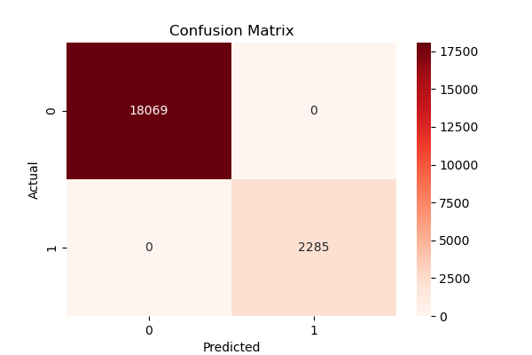
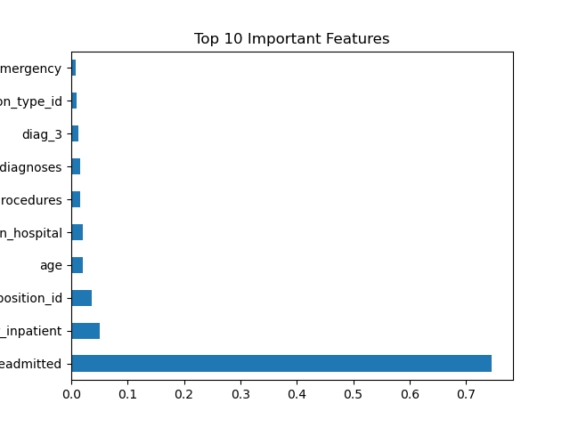

# 🏥 Hospital Readmission Prediction

Machine Learning project to predict whether a patient will be **readmitted to the hospital within 30 days** using the **Diabetes 130-US Hospitals dataset**.

The goal of this project is to help healthcare providers identify high-risk patients and reduce unnecessary hospital readmissions.

---

# 📊 Dataset

Dataset used: **Diabetes 130-US Hospitals Dataset**

It contains patient information such as:

* Demographics
* Diagnoses
* Medical procedures
* Medications
* Hospital visits

Source: UCI Machine Learning Repository

---

# ⚙️ Technologies Used

* Python
* Pandas
* NumPy
* Scikit-learn
* Seaborn
* Matplotlib
* Joblib

---

# 🔬 Project Workflow

1. Data Cleaning
2. Handling Missing Values
3. Exploratory Data Analysis (EDA)
4. Feature Engineering
5. Model Training
6. Model Evaluation
7. Feature Importance Analysis

---

# 🤖 Machine Learning Models

The following models were implemented:

* Logistic Regression
* Decision Tree
* Random Forest

**Random Forest achieved the best performance for this dataset.**

---

# 📈 Visualizations

## Model Accuracy Comparison

## Confusion Matrix

## Feature Importance

---

# 🧠 Key Insights

Important factors affecting hospital readmission include:

* Number of inpatient visits
* Time spent in hospital
* Number of diagnoses
* Medication changes

These features help identify patients with a higher risk of readmission.

---

# 🚀 Future Improvements

Possible improvements for this project:

* Hyperparameter tuning
* Using advanced models such as XGBoost
* Building a deployment dashboard
* Creating a real-time prediction system

---

# 👩‍💻 Author

**Navya**

Machine Learning & Data Science Enthusiast
